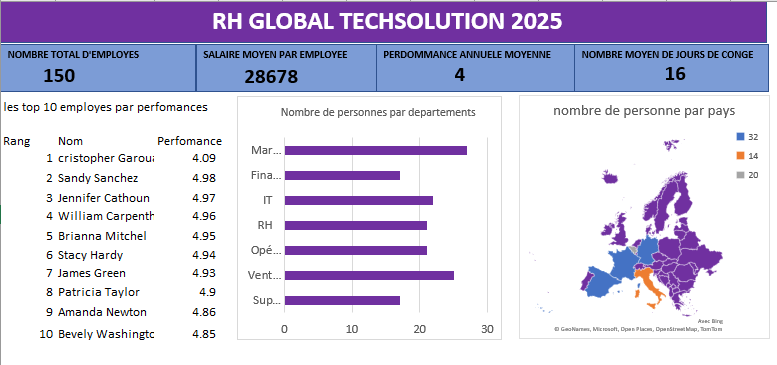

# 📊 Tableau de bord RH – RH GLOBAL TECHSOLUTION 2025

Bienvenue dans ce dépôt GitHub contenant une **capture d'écran du tableau de bord RH** de l’entreprise fictive **RH GLOBAL TECHSOLUTION 2025**.  
Ce tableau de bord synthétise les **principaux indicateurs RH** pour une meilleure visibilité des ressources humaines à l’échelle de l’entreprise.

---

## 🖼️ Aperçu visuel

---

## 🔍 Contenu du tableau de bord

### 🔢 Indicateurs clés (KPIs)

- **Nombre total d'employés** : 150
- **Salaire moyen par employé** : 28 678 €
- **Performance annuelle moyenne** : 4/5
- **Nombre moyen de jours de congé** : 16

---

### 🏆 Top 10 employés par performance

Un classement des 10 meilleurs employés basé sur leur **score de performance individuel** :
- Sandy Sanchez : 4.98
- Jennifer Cathoun : 4.97
- William Carpen† : 4.96  
*(et d'autres, voir image)*

---

### 🏢 Répartition par département

Le tableau présente également la **répartition du personnel** dans les différents départements :
- Marketing, Ventes, IT, RH, Opérations, Support, etc.

---

### 🌍 Répartition géographique

Une **carte interactive** montre la **distribution des employés par pays en Europe**, avec des zones de concentration plus importantes dans certaines régions.

---

## 📌 Objectif du tableau de bord

Ce tableau vise à :
- Visualiser la performance RH globale de l’entreprise
- Identifier les employés les plus performants
- Comprendre la structure interne des équipes
- Suivre la répartition géographique du personnel

---

## 🛠️ Outils utilisés

- **Excel** pour la création du tableau de bord
- **Graphiques Excel** pour la visualisation
- **GitHub** pour l’hébergement et la documentation

---

## 📬 Contact

Pour toute question ou suggestion, n’hésitez pas à me contacter !

